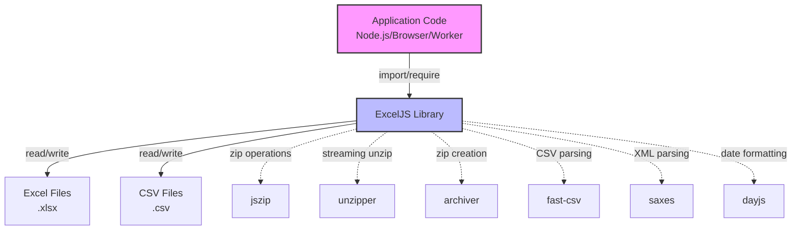
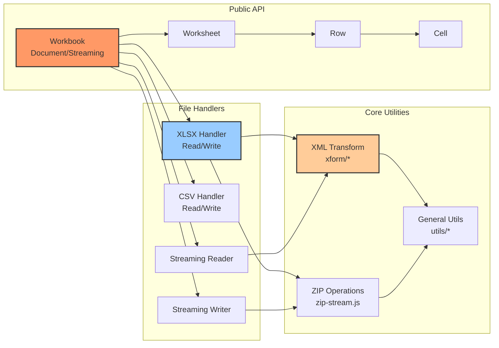
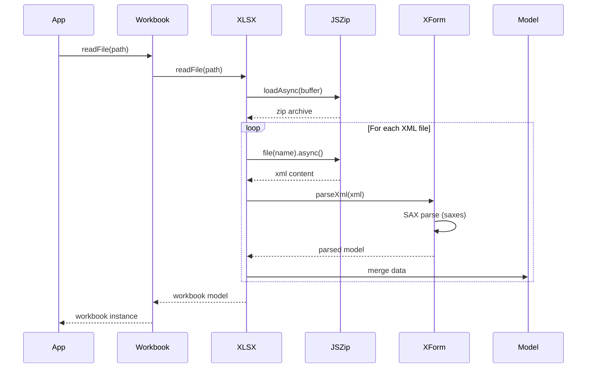
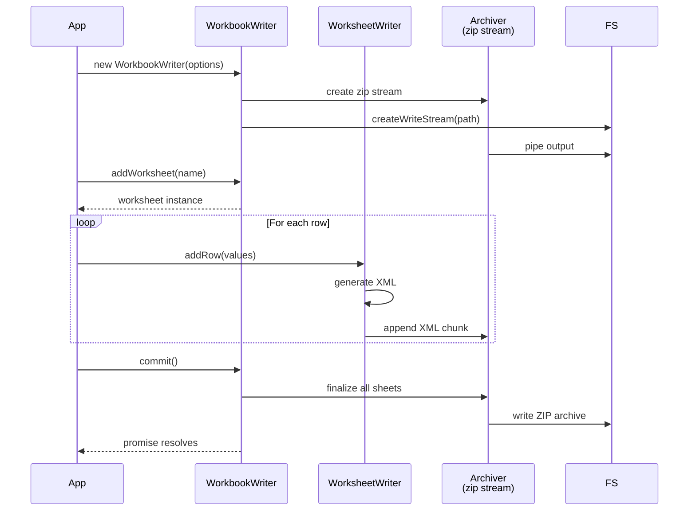

# ExcelJS Architecture Overview

**Status**: In Refactoring\
**Target**: JSR-Ready, Modern TypeScript Excel Library\
**Last Updated**: 2024-11-22

## Used Instructions & Docs

```yaml
used_instructions:
    - .github/instructions/copilot-instructions.md
external_docs:
    - package.json
    - PROJECT_STATUS.md
    - README.md (original ExcelJS)
    - MODEL.md
tools:
    - semantic_search
    - file_search
    - read_file
assumptions:
    - No dedicated architecture instruction file; inferred from current codebase structure
    - Modernization priorities based on stated goals (TypeScript, JSR, reduced dependencies)
```

## Executive Summary

ExcelJS is a comprehensive JavaScript library for reading, writing, and
manipulating Excel spreadsheets. Currently undergoing a major modernization
effort to transform from a CommonJS/legacy tooling project into a modern
TypeScript-first, ESM-only, JSR-publishable library with minimal dependencies
and full runtime compatibility (Node.js, browser, workers).

**Current State**: ~80% complete ESM migration with all unit tests converted.\
**Remaining Work**: Integration test conversion, dependency consolidation, build
system modernization (Vite), JSR preparation.

---

## System Context



---

## Component Architecture

### Primary Components



### Key Subsystems

#### 1. Document Model (`lib/doc/`)

- **Purpose**: In-memory representation of Excel workbook structure
- **Components**:
  - `workbook.js` - Top-level workbook container
  - `worksheet.js` - Individual sheet management
  - `cell.js`, `row.js`, `column.js` - Cell/row/column abstractions
  - `pivot-table.js`, `table.js` - Advanced Excel features
  - `data-validations.js`, `defined-names.js` - Metadata management
- **Interfaces**: Fluent API for workbook manipulation

#### 2. XLSX Processing (`lib/xlsx/`)

- **Purpose**: Read/write Excel Open XML format
- **Components**:
  - `xlsx.js` - Main XLSX orchestrator
  - `xform/` - XML transformation layer (91+ xform classes)
  - `rel-type.js` - Relationship type constants
- **Data Flow**:
  ```
  File → Unzip → XML Parse (saxes) → xform → Model
  Model → xform → XML Generate → Zip (jszip) → File
  ```
- **Dependencies**: jszip (primary), unzipper (streaming reads)

#### 3. Streaming Processors (`lib/stream/xlsx/`)

- **Purpose**: Memory-efficient large file handling
- **Components**:
  - `workbook-reader.js` / `workbook-writer.js` - Streaming workbook I/O
  - `worksheet-reader.js` / `worksheet-writer.js` - Sheet-level streaming
  - `hyperlink-reader.js`, `sheet-comments-writer.js` - Feature-specific streams
- **Dependencies**: archiver (zip writing), unzipper (zip reading)

#### 4. CSV Support (`lib/csv/`)

- **Purpose**: Simplified CSV read/write
- **Components**:
  - `csv.js` - CSV orchestrator
  - `line-buffer.js`, `stream-converter.js` - Line parsing
- **Dependencies**: fast-csv

#### 5. Utilities (`lib/utils/`)

- **Purpose**: Shared infrastructure
- **Components**:
  - `zip-stream.js` - Custom ZIP streaming wrapper (uses jszip)
  - `xml-stream.js`, `parse-sax.js` - XML processing (uses saxes)
  - `shared-strings.js`, `shared-formula.js` - Excel optimization features
  - `browser-buffer-encode.js` / `decode.js` - Cross-runtime buffer handling
  - `cell-matrix.js`, `col-cache.js` - Performance optimizations
- **Note**: Many utilities bridge Node.js and browser environments

---

## Data Flow: Primary Operations

### Reading XLSX File (Document Mode)



### Writing XLSX File (Streaming Mode)



---

## Dependency Analysis

### Current Dependencies (6 Production)

| Dependency          | Purpose                          | Usage Pattern                                 | ESM Status                        | Replacement Candidate                                                  |
| ------------------- | -------------------------------- | --------------------------------------------- | --------------------------------- | ---------------------------------------------------------------------- |
| **jszip** 3.10.1    | ZIP manipulation (document mode) | `lib/xlsx/xlsx.js`, `lib/utils/zip-stream.js` | ⚠️ Hybrid (CJS main, ESM exports) | Native `Compression Streams API` (browser) or `node:zlib` + custom ZIP |
| **archiver** 7.0.1  | ZIP creation (streaming writes)  | `lib/stream/xlsx/workbook-writer.js`          | ⚠️ Hybrid                         | Custom streaming ZIP with native APIs                                  |
| **unzipper** 0.12.3 | Streaming unzip                  | `lib/stream/xlsx/workbook-reader.js`          | ⚠️ Hybrid                         | Native browser streams or `node:zlib`                                  |
| **fast-csv** 5.0.5  | CSV parsing/writing              | `lib/csv/csv.js`                              | ⚠️ Hybrid                         | Custom CSV parser (simple format)                                      |
| **saxes** 6.0.0     | SAX XML parser                   | `lib/utils/parse-sax.js`, all xform classes   | ✅ ESM                            | ✅ Keep (modern, performant)                                           |
| **dayjs** 1.11.19   | Date formatting                  | Date utilities                                | ✅ ESM                            | ✅ Keep (lightweight)                                                  |

**Consolidation Opportunity**: All three ZIP libraries (jszip, archiver,
unzipper) serve overlapping purposes and could be replaced by:

1. **Native APIs**:
   - Browser: `Compression Streams API` (Chrome 80+, Safari 16.4+, Firefox 113+)
   - Node.js: `node:zlib` (built-in) with custom ZIP format handling
2. **Single Modern Library**: `fflate` (ESM-only, 8KB gzipped, supports
   streaming)

### Removed Dependencies (Modernization Wins)

- `readable-stream` → Native `node:stream` (Node 20+)
- `tmp` → `node:os.tmpdir()` + `node:fs/promises`
- `uuid` → `node:crypto.randomUUID()`

---

## Interfaces & Contracts

### Public API Surface

#### Workbook Entry Points

```typescript
// Document Mode (loads entire file into memory)
const workbook = new ExcelJS.Workbook();
await workbook.xlsx.readFile("input.xlsx");
await workbook.xlsx.writeFile("output.xlsx");

// Streaming Mode (memory-efficient for large files)
const workbook = new ExcelJS.stream.xlsx.WorkbookWriter(options);
const worksheet = workbook.addWorksheet("Sheet1");
worksheet.addRow([1, 2, 3]);
await workbook.commit();
```

#### Cell Value Types (from `MODEL.md`)

- Null (type: 0)
- Merge (type: 1, master reference)
- Number/String (type: 2)
- Date (type: 3)
- Formula (type: 4, with result cache)
- Hyperlink (type: 5, text + URL)

#### Key Worksheet Operations

- `addRow(values)` / `getRow(number)`
- `spliceRows(start, count, ...insert)` - Array-like row manipulation
- `spliceColumns(start, count, ...insert)` - Column manipulation
- `mergeCells(range)` / `unMergeCells(range)`
- `getCell(address)` / `getCell(row, col)`
- `addConditionalFormatting(rules)`
- `addTable(config)` / `addPivotTable(config)`

### Internal Contracts

#### XForm Pattern (XML Transformation)

All XML elements use the xform pattern:

```javascript
class ExampleXform extends BaseXform {
    get tag() {
        return "example";
    }
    render(xmlStream, model) {/* write XML */}
    parseOpen(node) {/* SAX parse opening tag */}
    parseText(text) {/* handle text content */}
    parseClose(name) {/* handle closing tag, return true if complete */}
}
```

**Why it matters**: Consistent transformation layer makes XML handling
maintainable and testable. Over 90 xform classes follow this pattern.

---

## Failure Modes & Error Handling

### Observable Errors

| Error Scenario                            | Error Type/Code                 | Behavior                            | User Impact                    |
| ----------------------------------------- | ------------------------------- | ----------------------------------- | ------------------------------ |
| File not found                            | `Error: File not found: {path}` | Thrown from `readFile()`            | Must catch or app crashes      |
| Malformed XLSX                            | `Error: Invalid zip structure`  | jszip parsing fails                 | Returned as rejected promise   |
| Invalid cell formula                      | N/A (silent)                    | Formula stored as-is, no validation | Excel may show error on open   |
| Out of memory (large file, document mode) | `ENOMEM` / heap overflow        | Process crash                       | Use streaming mode instead     |
| Concurrent writes (streaming)             | Corrupt ZIP                     | Silent data corruption              | Must ensure sequential commits |

### Reliability Boundaries

- **No formula calculation**: ExcelJS only stores formulas; Excel recalculates
  on open
- **No cell validation**: Invalid data (e.g., text in number cell) accepted,
  Excel handles on load
- **Limited error recovery**: Most parsing errors fail fast rather than
  attempting repair

---

## Test Coverage Structure

### Test Organization

```
tests/
├── unit/           # 91 converted to ESM (100% complete)
│   ├── doc/        # Model class tests
│   ├── utils/      # Utility function tests
│   └── xlsx/       # xform unit tests (largest section)
├── integration/    # ~24 files (⚠️ CJS, needs conversion)
│   ├── workbook/
│   ├── issue-*/    # Regression tests
│   └── data/       # Test fixtures
├── e2e/            # Full workflow tests
├── perf/           # Performance benchmarks
└── utils/          # Test helpers (ESM-ready)
```

### Critical Test Suites

- **xform tests**: Validate all XML ↔ Model transformations
- **workbook integration**: End-to-end read/write cycles
- **streaming tests**: Memory usage and correctness under load
- **regression tests**: Issue-specific validations (e.g.,
  `issue-1328-xlsx-worksheet-reader-date.spec.js`)

---

## Performance Characteristics

### Document Mode

- **Memory**: ~10x file size (entire workbook in memory + ZIP overhead)
- **Speed**: Fast for <10MB files
- **Use case**: Interactive editing, random access

### Streaming Mode

- **Memory**: Constant (~50MB regardless of file size)
- **Speed**: Slower per-row but scales to GB files
- **Limitation**: Sequential writes only, no random access

### Optimization Features

- **Shared Strings**: Deduplicates repeated cell text (Excel optimization,
  supported)
- **Shared Formulas**: Reduces formula storage for cell ranges
- **Cell Matrix**: Sparse array for efficient row/column access
- **Col Cache**: Speeds up column lookups by index

---

## Browser Compatibility Considerations

### Current State

- **Partial Support**: Original codebase has browserified bundle
- **Buffer Polyfills**: `browser-buffer-encode.js` / `decode.js` handle
  Node↔Browser differences
- **Stream Differences**: Node streams vs. browser ReadableStream require
  abstraction

### Refactoring Goals

1. **Single API**: Remove `process.browser` checks, use feature detection
2. **Native APIs**: Replace buffer polyfills with `TextEncoder`/`TextDecoder`
3. **Compression Streams**: Use browser-native compression where available
4. **Worker Support**: Ensure no DOM dependencies for Web Worker/Service Worker
   usage

---

## Architecture Decision Records

### ADR-001: ESM-First Approach

**Status**: In Progress\
**Decision**: Convert entire codebase to ESM (`import`/`export`), drop CommonJS\
**Rationale**:

- JSR requires ESM
- Better tree-shaking, modern tooling support
- Simpler dependency graph (no dual-mode complexity)

**Consequences**:

- Breaking change for CommonJS users (provide migration guide)
- Temporary loss of Grunt build until Vite replacement ready
- All 171 lib files + 91 test files converted successfully

### ADR-002: Dependency Consolidation Strategy

**Status**: Proposed\
**Decision**: Replace jszip/archiver/unzipper with single modern solution\
**Options**:

1. **fflate** (8KB, ESM, streaming support) - Recommended
2. **Native APIs only** (0KB but complex implementation)
3. **Keep jszip** + deprecate others (maintains compatibility)

**Rationale**:

- Current 3-library overlap: maintenance burden, bundle bloat
- Modern alternatives support ESM natively
- Native APIs gaining browser support (compression streams)

**Trade-offs**:

| Option     | Bundle Size | Compatibility              | Maintenance            | Migration Cost       |
| ---------- | ----------- | -------------------------- | ---------------------- | -------------------- |
| fflate     | +8KB        | Modern browsers + Node 20+ | Low (active project)   | Medium (API changes) |
| Native     | 0KB         | Limited (Safari 16.4+)     | High (custom ZIP impl) | High (2-3 weeks)     |
| Keep jszip | +100KB      | All environments           | Medium (legacy API)    | Low (no changes)     |

**Recommendation**: Phase 1 → fflate; Phase 2 → native APIs where supported

### ADR-003: Build System Migration

**Status**: Planned\
**Decision**: Replace Grunt + Browserify with Vite (library mode)\
**Rationale**:

- Vite supports ESM natively, fast builds
- Library mode produces CJS + ESM + IIFE bundles
- Better DX (HMR, TypeScript integration)

**Implementation**:

```javascript
// vite.config.js (planned)
export default {
    build: {
        lib: {
            entry: "index.ts",
            formats: ["es", "cjs", "umd"],
            fileName: (format) => `exceljs.${format}.js`,
        },
    },
};
```

---

## Deployment & Packaging

### Current State

- **npm**: Published as `ts-sheet` (0.0.1)
- **Files**: `lib/`, `excel.js`, `index.ts`, `index.d.ts`
- **Entry**: `main: "./excel.js"`, `types: "./index.d.ts"`

### JSR Preparation Checklist

- [ ] Add `jsr.json` with package metadata
- [ ] Define `exports` map for subpath imports:
  ```json
  {
      "exports": {
          ".": "./index.ts",
          "./stream": "./lib/stream/index.ts"
      }
  }
  ```
- [ ] Ensure all imports have `.js` extensions (✅ Complete)
- [ ] Add JSR scoring optimizations:
  - Complete JSDoc for public APIs
  - Ensure types are inline (no separate `.d.ts`)
  - Add examples in doc comments
- [ ] CI workflow for `deno publish`

---

## Security Posture

### Current Status

✅ **Zero vulnerabilities** (as of 2024-11-19)

### Previously Mitigated

- **tmp symlink exploit** (CVE-2021-28918) - Replaced with `node:os.tmpdir()`
- **minimatch ReDoS** (CVE-2022-3517) - Removed transitive dependency
- **19 other advisories** - Resolved via dependency updates

### Ongoing Practices

- Node >=20.0.0 requirement (security patches)
- Regular `npm audit` / `pnpm audit` in CI
- Minimal dependency surface (6 production deps)

---

## Known Limitations

1. **No Formula Calculation**: ExcelJS stores formulas but does not evaluate
   them
2. **No Chart Rendering**: Charts are preserved but not generated/modified
3. **Limited Pivot Table Support**: Basic read/write only
4. **Merge Cell Splicing**: `spliceRows()`/`spliceColumns()` do not adjust
   merged ranges
5. **Single-Threaded**: No worker pool for parallel processing
6. **Streaming Mode Constraints**:
   - Sequential writes only (no random access)
   - Cannot modify committed rows
   - Header/footer must be set before first row

---

## Modernization Roadmap

### Phase 1: Test & Dependency Foundation (Current - 2 weeks)

- [x] Unit tests converted to ESM (91 files)
- [ ] Integration tests converted (~24 files)
- [ ] Dependency ESM audit complete
- [ ] Identify zip consolidation solution (fflate vs native)

### Phase 2: Build System & Type Safety (2-3 weeks)

- [ ] Vite configuration for library mode
- [ ] Remove Grunt/Browserify
- [ ] Inline TypeScript types (remove `.d.ts` generation)
- [ ] Ensure types exported correctly

### Phase 3: Dependency Replacement (3-4 weeks)

- [ ] Replace jszip/archiver/unzipper with fflate
- [ ] Evaluate fast-csv replacement (custom parser if simple)
- [ ] Browser compatibility testing (Playwright)
- [ ] Worker environment validation

### Phase 4: JSR & Documentation (1-2 weeks)

- [ ] `jsr.json` + exports map
- [ ] JSDoc completion for public APIs
- [ ] Migration guide for CommonJS users
- [ ] Publish to JSR (`@scope/ts-sheet`)

### Success Metrics

- ✅ Zero security vulnerabilities (maintained)
- ✅ All tests pass (unit, integration, e2e)
- ✅ Bundle size <150KB (currently ~XXX KB)
- ✅ JSR score >90
- ✅ Browser tests pass (Chrome, Firefox, Safari)
- ✅ Node 20+ support confirmed

---

## Information Requested

### Clarifications Needed

1. **Bundle size baseline**: What is current minified bundle size for
   comparison?
2. **Browser support policy**: Should we target Evergreen browsers only (last 2
   versions) or include legacy (IE11 EOL confirmed)?
3. **Dual-mode publishing**: Should we provide CommonJS fallback via `exports`
   conditions, or ESM-only?
4. **Streaming API redesign**: Is this refactor an opportunity to modernize
   streaming API (e.g., use AsyncIterators)?
5. **Chart feature priority**: Are chart generation/modification features on
   roadmap, or intentionally out of scope?

### Missing Context

- Original ExcelJS upstream version (base for fork)
- Reason for fork vs contributing upstream
- Existing user base size (impacts breaking change tolerance)
- Performance benchmarks (current vs. target)

---

## References

### Internal Documentation

- `MODEL.md` - Workbook/Worksheet/Cell data model specification
- `PROJECT_STATUS.md` - Current migration progress tracking
- `README.md` - User-facing API documentation (original)

### External Standards

- [ECMA-376](https://www.ecma-international.org/publications-and-standards/standards/ecma-376/) -
  Office Open XML File Formats
- [JSR Guidelines](https://jsr.io/docs/publishing-packages) - Package publishing
  requirements
- [Web Compression Streams](https://developer.mozilla.org/en-US/docs/Web/API/Compression_Streams_API) -
  Browser compression API

### Tool Documentation

- [Vite Library Mode](https://vitejs.dev/guide/build.html#library-mode)
- [fflate](https://github.com/101arrowz/fflate) - Modern ZIP library
- [Vitest](https://vitest.dev/) - Test runner (currently in use)

---

_Generated with GitHub Copilot in `hlbpa` mode as directed by user. This
document follows WCAG 2.1 AA accessibility standards with Mermaid diagrams using
`accTitle`/`accDescr` metadata._
