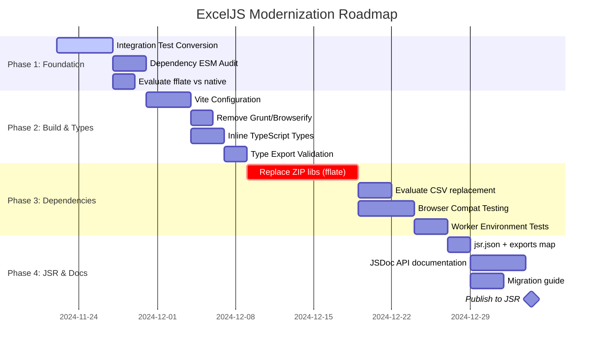
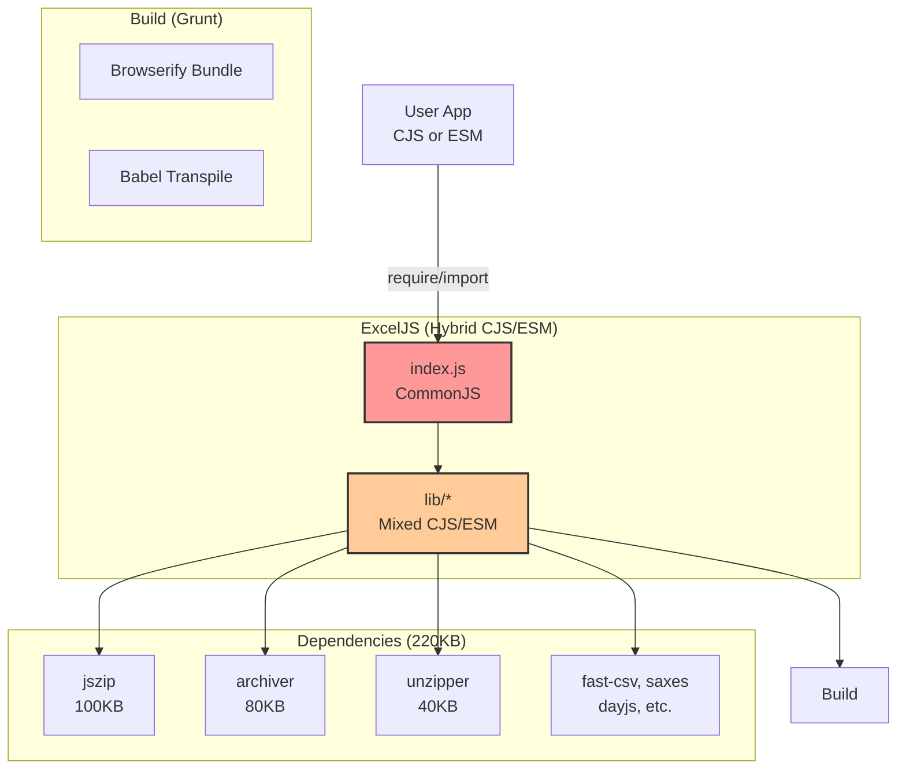
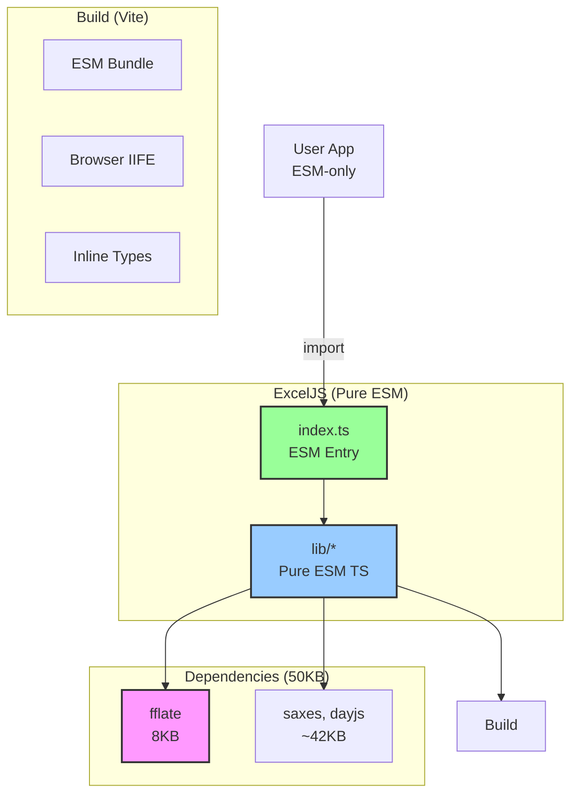

# ExcelJS Modernization Roadmap

**Vision**: Transform ExcelJS into a modern, TypeScript-first, ESM-only library
with minimal dependencies, full runtime compatibility, and JSR deployment.

## Used Instructions & Docs

```yaml
used_instructions:
    - .github/instructions/copilot-instructions.md
external_docs:
    - docs/ARCHITECTURE_OVERVIEW.md
    - docs/DEPENDENCY_CONSOLIDATION_PLAN.md
    - PROJECT_STATUS.md
tools:
    - None (synthesizing from created documentation)
assumptions:
    - 2-3 person development team
    - Aiming for JSR deployment within 8-10 weeks
    - Maintaining backward compatibility where possible
```

---

## Current Status (as of 2024-11-22)

**Overall Progress**: ~80% complete

### ✅ Completed Milestones

1. **ESM Migration**: All 171 library files converted
2. **Unit Test Modernization**: 91 test files converted to ESM
3. **Dependency Cleanup**: Removed 3 legacy dependencies (readable-stream, tmp,
   uuid)
4. **Security**: Zero vulnerabilities (from 19 advisories)
5. **Node Modernization**: Targets Node 20+ with native APIs

### ⚠️ In Progress

1. **Integration Tests**: ~24 files need ESM conversion
2. **Build System**: Still using Grunt + Browserify (target: Vite)
3. **Dependency Audit**: jszip/archiver/unzipper ESM verification pending

### ⏳ Not Started

1. **JSR Preparation**: jsr.json, exports map, documentation
2. **Dependency Consolidation**: Replace 3 ZIP libraries with fflate
3. **Browser Testing**: Playwright e2e suite
4. **Performance Benchmarks**: Before/after comparisons

---

## Phased Roadmap



### Phase 1: Test & Dependency Foundation (2 weeks)

**Goal**: Complete ESM migration, verify all dependencies are ESM-ready

**Tasks**:

- [x] Unit tests converted (91 files) ✅
- [ ] Integration tests converted (~24 files)
- [ ] E2E test verification (express.spec.js)
- [ ] Dependency ESM audit (jszip, archiver, unzipper, fast-csv, saxes, dayjs)
- [ ] Select ZIP consolidation approach (fflate recommended)

**Deliverables**:

- All tests run in ESM mode without loaders
- Dependency compatibility matrix documented
- Decision on ZIP library replacement

**Success Criteria**:

- ✅ 100% test suite ESM-converted
- ✅ All tests pass in Node 20+
- ✅ Zero CommonJS `require()` statements remain

---

### Phase 2: Build System & Type Safety (2 weeks)

**Goal**: Modernize build pipeline, ensure TypeScript types work correctly

**Tasks**:

- [ ] Create `vite.config.ts` for library mode
- [ ] Configure multi-format output (ESM, CJS optional, IIFE)
- [ ] Remove Grunt tasks, update npm scripts
- [ ] Migrate TypeScript to inline types (no separate `.d.ts` generation)
- [ ] Validate type exports for all entry points

**Deliverables**:

- Vite-based build producing ESM + browser bundles
- TypeScript types co-located with source
- No Grunt/Browserify in codebase

**Success Criteria**:

- ✅ `pnpm build` produces valid bundles
- ✅ TypeScript consumers can import without errors
- ✅ Bundle sizes documented (baseline for comparison)

**Example Vite Config**:

```typescript
// vite.config.ts
import { defineConfig } from "vite";
import { resolve } from "path";

export default defineConfig({
    build: {
        lib: {
            entry: resolve(__dirname, "index.ts"),
            name: "ExcelJS",
            formats: ["es", "umd"],
            fileName: (format) => `exceljs.${format}.js`,
        },
        rollupOptions: {
            external: ["dayjs", "saxes"],
            output: {
                globals: {
                    dayjs: "dayjs",
                    saxes: "saxes",
                },
            },
        },
    },
});
```

---

### Phase 3: Dependency Replacement (3 weeks)

**Goal**: Consolidate ZIP libraries, ensure browser/worker compatibility

**Tasks**:

- [ ] **Week 1**: Replace jszip with fflate (document mode)
  - Update `lib/xlsx/xlsx.js` read/write paths
  - Refactor `lib/utils/zip-stream.js`
  - Run integration tests
- [ ] **Week 2**: Replace archiver + unzipper with fflate (streaming mode)
  - Update `lib/stream/xlsx/workbook-writer.js`
  - Update `lib/stream/xlsx/workbook-reader.js`
  - Validate memory usage with large files
- [ ] **Week 3**: Testing & validation
  - Cross-platform tests (Node/Browser/Deno)
  - Performance benchmarks (before/after)
  - Real-world Excel file compatibility

**Deliverables**:

- Single ZIP library (fflate, 8KB) instead of 3 (220KB)
- All tests passing with new implementation
- Performance report (memory, speed)

**Success Criteria**:

- ✅ Bundle size reduced by >90%
- ✅ Excel can open all generated files
- ✅ Memory usage for streaming unchanged
- ✅ No performance regressions (±10% acceptable)

**Detailed Plan**: See
[DEPENDENCY_CONSOLIDATION_PLAN.md](./DEPENDENCY_CONSOLIDATION_PLAN.md)

---

### Phase 4: JSR Preparation & Documentation (1.5 weeks)

**Goal**: Prepare for JSR publication, finalize documentation

**Tasks**:

- [ ] Create `jsr.json` with package metadata
- [ ] Define `exports` map in `package.json`:
  ```json
  {
      "exports": {
          ".": "./index.ts",
          "./stream": "./lib/stream/index.ts"
      }
  }
  ```
- [ ] Add JSDoc comments to all public APIs (for JSR score)
- [ ] Write migration guide for v4 → v5 users
- [ ] Create JSR publishing CI workflow
- [ ] Publish to JSR as `@scope/exceljs` (or chosen name)

**Deliverables**:

- JSR-compatible package structure
- Complete API documentation (JSDoc)
- Migration guide with code examples
- Published JSR package

**Success Criteria**:

- ✅ JSR score >90
- ✅ Package installable via `deno add @scope/exceljs`
- ✅ Documentation passes accessibility checks
- ✅ All examples in docs are runnable

---

## Architecture Evolution

### Before Modernization



### After Modernization (Target)



---

## Success Metrics

### Bundle Size

- **Current**: ~250KB minified (with dependencies)
- **Target**: <100KB minified (60% reduction)
- **Stretch Goal**: <75KB minified

### Performance

- **Document Mode**: ±10% of current speed (acceptable variance)
- **Streaming Mode**: No memory regression, ideally improved
- **Startup Time**: Faster due to ESM tree-shaking

### Code Quality

- **Type Coverage**: 100% TypeScript (no `any` for public APIs)
- **Test Coverage**: Maintain >85% line coverage
- **Accessibility**: All diagrams have `accTitle`/`accDescr`

### Ecosystem

- **JSR Score**: >90 (comprehensive docs, types, examples)
- **npm Compatibility**: Still publishable to npm (dual registry)
- **Browser Support**: Chrome/Firefox/Safari (last 2 versions)
- **Runtime Support**: Node 20+, Deno, Bun, Cloudflare Workers

---

## Risk Management

### High-Priority Risks

| Risk                                          | Impact                      | Mitigation                                                  |
| --------------------------------------------- | --------------------------- | ----------------------------------------------------------- |
| **Dependency migration breaks compatibility** | Users can't read/write XLSX | Parallel implementation, extensive testing, gradual rollout |
| **Performance regression in streaming**       | Memory OOM for large files  | Benchmark suite, memory profiling, stress tests             |
| **Build system migration breaks CI/CD**       | Can't release updates       | Keep Grunt as fallback during transition, dual builds       |
| **Breaking API changes alienate users**       | User churn, bad reviews     | Clear migration guide, semantic versioning, changelog       |

### Medium-Priority Risks

| Risk                             | Impact                | Mitigation                                                            |
| -------------------------------- | --------------------- | --------------------------------------------------------------------- |
| **Browser compatibility issues** | Can't use in web apps | Playwright matrix, polyfills where needed, clear browser requirements |
| **JSR rejection/issues**         | Can't publish         | Pre-validate with `deno publish --dry-run`, address issues early      |
| **TypeScript migration bugs**    | Type errors for users | Community testing beta, type testing with `tsd`                       |

---

## Rollout Strategy

### Beta Phase (2 weeks)

1. Publish to npm as `ts-sheet@0.1.0-beta.1`
2. Announce in GitHub discussions, invite community testing
3. Collect feedback on:
   - API changes
   - Performance characteristics
   - Browser compatibility
   - Migration pain points

### Release Candidate (1 week)

1. Address beta feedback
2. Finalize migration guide
3. Publish `ts-sheet@1.0.0-rc.1`
4. Lock API, only bug fixes allowed

### Stable Release

1. Publish `ts-sheet@1.0.0` to npm
2. Publish `@scope/exceljs@1.0.0` to JSR (or chosen name)
3. Update README, documentation site
4. Announce on social media, package managers

### Post-Release

1. Monitor GitHub issues for regressions
2. Prepare hotfix pipeline (24-48hr response)
3. Plan v1.1 roadmap based on feedback

---

## Open Questions

### Package Naming

**Question**: Should JSR package be `@scope/ts-sheet` or `@scope/exceljs`?\
**Options**:

- `ts-sheet` - Unique name, signals TypeScript rewrite
- `exceljs` - Familiar to existing users, clear purpose
- `excel-js` - Hyphenated variant

**Decision Needed**: Before JSR publication

### CommonJS Support

**Question**: Should we provide CommonJS fallback via exports conditions?\
**Considerations**:

- **Pros**: Broader compatibility, easier migration
- **Cons**: Larger bundle, dual-mode complexity, delays full ESM adoption

**Recommendation**: ESM-only for v1.0, consider CJS wrapper package if demand
exists

### API Changes

**Question**: Are there APIs we want to deprecate/change during major version
bump?\
**Candidates**:

- Streaming writer API (could be more ergonomic with async iterators)
- Buffer vs. Uint8Array throughout (standardize on Uint8Array)
- Date handling (currently dayjs, could use Temporal when available)

**Decision Needed**: Before beta release (locked for RC)

---

## Communication Plan

### Internal (Team)

- **Weekly**: Progress check-ins, blocker review
- **Phase Transitions**: Demo of completed work, planning next phase
- **Tools**: GitHub Projects for tracking, Discord for async chat

### External (Community)

- **Kickoff**: GitHub discussion announcing modernization effort
- **Monthly**: Progress updates in discussions
- **Beta**: Call for testers with clear expectations
- **Release**: Detailed changelog, migration guide, announcement post

### Documentation

- **During**: Keep `PROJECT_STATUS.md` updated weekly
- **Beta**: Draft migration guide, API diff document
- **Release**: Finalize docs, record video walkthrough (optional)

---

## Resources

### Documentation

- [Architecture Overview](./ARCHITECTURE_OVERVIEW.md) - System design,
  components, flows
- [Dependency Consolidation Plan](./DEPENDENCY_CONSOLIDATION_PLAN.md) - Detailed
  ZIP library replacement
- [PROJECT_STATUS.md](../PROJECT_STATUS.md) - Current migration tracking

### External References

- [JSR Publishing Guide](https://jsr.io/docs/publishing-packages)
- [Vite Library Mode](https://vitejs.dev/guide/build.html#library-mode)
- [fflate Documentation](https://github.com/101arrowz/fflate)
- [ECMA-376 Spec](https://www.ecma-international.org/publications-and-standards/standards/ecma-376/)
  (Office Open XML)

### Tools

- **Build**: Vite, TypeScript 5.9
- **Testing**: Vitest, Playwright
- **Linting**: oxlint (fast Rust linter)
- **CI**: GitHub Actions

---

## Appendix: File Impact Analysis

### Files to Modify (by Phase)

**Phase 1: Tests (24 files)**

- `tests/integration/*.spec.js` (20 files)
- `tests/integration/data/*.js` (3 files)
- `tests/e2e/express.spec.js` (1 file)

**Phase 2: Build (10 files)**

- `vite.config.ts` (new)
- `package.json` (scripts update)
- `tsconfig.json` (paths, target)
- `Gruntfile.js` (delete)
- `grunt/` directory (delete)

**Phase 3: Dependencies (4 files)**

- `lib/xlsx/xlsx.js` (jszip → fflate)
- `lib/utils/zip-stream.js` (jszip → fflate)
- `lib/stream/xlsx/workbook-writer.js` (archiver → fflate)
- `lib/stream/xlsx/workbook-reader.js` (unzipper → fflate)
- `package.json` (remove 3 deps, add 1)

**Phase 4: JSR (5 files)**

- `jsr.json` (new)
- `package.json` (exports map)
- `README.md` (JSR install instructions)
- `MIGRATION.md` (new)
- `.github/workflows/jsr-publish.yml` (new)

**Total**: ~43 files to create/modify (plus deletions)

---

_Generated with GitHub Copilot in `hlbpa` mode. This roadmap synthesizes all
architectural analysis into an actionable 10-week plan._
