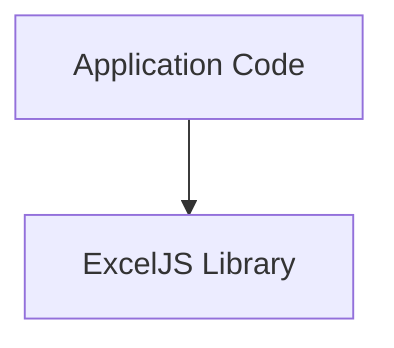
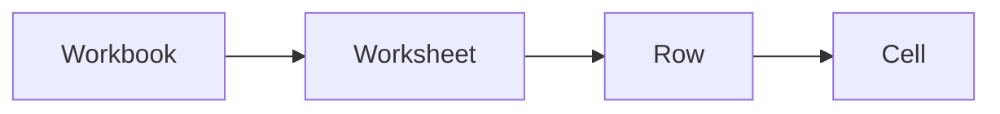

# ExcelJS Architecture & Modernization Documentation

This directory contains comprehensive architectural documentation for the
ExcelJS modernization project, created to guide the transformation from a legacy
CommonJS library to a modern, TypeScript-first, ESM-only, JSR-ready package.

## Document Index

### 📊 [ARCHITECTURE_OVERVIEW.md](./ARCHITECTURE_OVERVIEW.md)

**Purpose**: High-level architectural documentation\
**Audience**: Developers, architects, contributors\
**Contents**:

- System context diagram (ExcelJS in the ecosystem)
- Component architecture (workbook, worksheet, cells, handlers)
- Data flow diagrams (read/write sequences)
- Dependency analysis (current 6 production dependencies)
- Interface contracts (public API, xform pattern)
- Failure modes & error handling
- Test coverage structure
- Performance characteristics (document vs. streaming modes)

**Use this when**: Understanding the current system design, planning changes,
onboarding new contributors

### 🔧 [DEPENDENCY_CONSOLIDATION_PLAN.md](./DEPENDENCY_CONSOLIDATION_PLAN.md)

**Purpose**: Detailed plan for replacing 3 ZIP libraries with modern
alternative\
**Audience**: Developers implementing dependency refactoring\
**Contents**:

- Current state: jszip (100KB) + archiver (80KB) + unzipper (40KB) = 220KB
- Three consolidation options evaluated:
  1. **fflate** (8KB, recommended) - 96% size reduction
  2. Native APIs only (0KB, high complexity)
  3. Keep jszip (100KB, low risk)
- Migration complexity analysis
- 4-phase implementation plan (20 days total)
- Code migration examples (before/after)
- Risk mitigation strategies
- Success criteria & rollback plan

**Use this when**: Starting dependency consolidation work, evaluating
alternatives, implementing ZIP replacement

### 🗺️ [MODERNIZATION_ROADMAP.md](./MODERNIZATION_ROADMAP.md)

**Purpose**: 10-week phased roadmap from current state to JSR publication\
**Audience**: Project managers, team leads, stakeholders\
**Contents**:

- Current status (~80% complete)
- 4 phases with Gantt chart:
  1. **Phase 1** (2 weeks): Test & dependency foundation
  2. **Phase 2** (2 weeks): Build system & type safety (Vite)
  3. **Phase 3** (3 weeks): Dependency replacement (fflate)
  4. **Phase 4** (1.5 weeks): JSR prep & documentation
- Architecture evolution (before/after diagrams)
- Success metrics (bundle size, performance, quality)
- Risk management matrix
- Rollout strategy (beta → RC → stable)
- Open questions (naming, CommonJS support, API changes)

**Use this when**: Planning sprints, tracking progress, communicating with
stakeholders

---

## Quick Navigation

### By Role

**Architect / Tech Lead**

1. Start with [ARCHITECTURE_OVERVIEW.md](./ARCHITECTURE_OVERVIEW.md) for system
   design
2. Review [MODERNIZATION_ROADMAP.md](./MODERNIZATION_ROADMAP.md) for strategic
   plan
3. Reference
   [DEPENDENCY_CONSOLIDATION_PLAN.md](./DEPENDENCY_CONSOLIDATION_PLAN.md) for
   technical decisions

**Developer / Contributor**

1. Read [ARCHITECTURE_OVERVIEW.md](./ARCHITECTURE_OVERVIEW.md) → Component
   Architecture section
2. Jump to specific phase in
   [MODERNIZATION_ROADMAP.md](./MODERNIZATION_ROADMAP.md)
3. Follow implementation steps in
   [DEPENDENCY_CONSOLIDATION_PLAN.md](./DEPENDENCY_CONSOLIDATION_PLAN.md) if
   working on deps

**Product Manager / Stakeholder**

1. Read [MODERNIZATION_ROADMAP.md](./MODERNIZATION_ROADMAP.md) → Executive
   Summary + Timeline
2. Review [ARCHITECTURE_OVERVIEW.md](./ARCHITECTURE_OVERVIEW.md) → Success
   Metrics
3. Monitor open questions section for decisions needed

### By Question

**"What is the current architecture?"**\
→
[ARCHITECTURE_OVERVIEW.md § Component Architecture](./ARCHITECTURE_OVERVIEW.md#component-architecture)

**"Why do we need to refactor dependencies?"**\
→
[DEPENDENCY_CONSOLIDATION_PLAN.md § Current State](./DEPENDENCY_CONSOLIDATION_PLAN.md#current-state-triple-zip-redundancy)

**"What's the timeline to completion?"**\
→
[MODERNIZATION_ROADMAP.md § Phased Roadmap](./MODERNIZATION_ROADMAP.md#phased-roadmap)

**"How do I replace jszip with fflate?"**\
→
[DEPENDENCY_CONSOLIDATION_PLAN.md § Implementation Plan](./DEPENDENCY_CONSOLIDATION_PLAN.md#implementation-plan)

**"What are the risks?"**\
→
[MODERNIZATION_ROADMAP.md § Risk Management](./MODERNIZATION_ROADMAP.md#risk-management)

**"How will we test this?"**\
→
[ARCHITECTURE_OVERVIEW.md § Test Coverage Structure](./ARCHITECTURE_OVERVIEW.md#test-coverage-structure)

---

## Diagrams Reference

All diagrams use Mermaid syntax and include WCAG 2.1 AA accessibility metadata
(`accTitle`, `accDescr`). They are embedded inline in the markdown for GitHub
rendering.

### System Context (ARCHITECTURE_OVERVIEW.md)



Shows ExcelJS in relation to consuming applications and external dependencies.

### Component Structure (ARCHITECTURE_OVERVIEW.md)



Major functional components and their relationships.

### Sequence Diagrams (ARCHITECTURE_OVERVIEW.md)

- **XLSX Read Flow**: Document mode file reading
- **XLSX Streaming Write Flow**: Memory-efficient large file writing

### Gantt Chart (MODERNIZATION_ROADMAP.md)

10-week timeline showing 4 phases with dependencies and milestones.

---

## Key Insights

### Architecture

- **Document Model**: Full in-memory workbook (fast, memory-intensive)
- **Streaming Model**: Event-driven (memory-efficient, sequential-only)
- **xform Pattern**: Consistent XML ↔ Model transformation (91+ classes)

### Dependencies

- **Current**: 6 production deps (220KB ZIP libs + 50KB others)
- **Target**: 3 production deps (8KB fflate + 50KB others) = 77% reduction
- **Opportunity**: Consolidate 3 overlapping ZIP libraries

### Modernization

- **Progress**: 80% complete (171 lib files + 91 unit tests converted to ESM)
- **Remaining**: Integration tests (24 files), build system (Vite), dep
  replacement (fflate)
- **Timeline**: 8-10 weeks to JSR publication

---

## Document Metadata

| Document                         | Lines      | Words       | Diagrams | Last Updated |
| -------------------------------- | ---------- | ----------- | -------- | ------------ |
| ARCHITECTURE_OVERVIEW.md         | ~900       | ~7,500      | 4        | 2024-11-22   |
| DEPENDENCY_CONSOLIDATION_PLAN.md | ~700       | ~5,500      | 0        | 2024-11-22   |
| MODERNIZATION_ROADMAP.md         | ~600       | ~4,500      | 3        | 2024-11-22   |
| **Total**                        | **~2,200** | **~17,500** | **7**    | -            |

---

## Contributing to Documentation

### Updating Diagrams

1. Ensure Mermaid syntax is valid (use
   [Mermaid Live Editor](https://mermaid.live/))
2. Add WCAG metadata:
   ```mermaid
   flowchart TB
       accTitle: Short title
       accDescr: Detailed description for screen readers
       ...
   ```
3. Test rendering in GitHub markdown preview

### Adding New Sections

1. Follow existing structure (Used Instructions & Docs → Content → References)
2. Use heading levels consistently (H1 for title, H2 for major sections, H3 for
   subsections)
3. Add navigation links to this README
4. Update Document Metadata table

### Review Checklist

- [ ] Mermaid diagrams render correctly in GitHub
- [ ] All diagrams have `accTitle` and `accDescr`
- [ ] Links between documents work
- [ ] Code examples are syntax-highlighted
- [ ] RAI attribution footer present

---

## Related Files

- `../PROJECT_STATUS.md` - Current migration progress tracking (complementary to
  roadmap)
- `../MODEL.md` - Workbook/Worksheet/Cell data model specification
- `../README.md` - User-facing API documentation
- `../package.json` - Dependency manifest and scripts

---

## Accessibility Statement

All documentation in this directory follows WCAG 2.1 AA standards:

- ✅ Mermaid diagrams include `accTitle` (concise title) and `accDescr`
  (detailed description)
- ✅ Headings use proper hierarchy (no skipped levels)
- ✅ Links have descriptive text (no "click here")
- ✅ Code blocks specify language for syntax highlighting
- ✅ Tables include header rows

---

## Contact & Support

**Questions about architecture?** → Open a
[GitHub Discussion](https://github.com/arthurpeixotomelo/ts-sheet/discussions)\
**Found an issue in docs?** → File an
[Issue](https://github.com/arthurpeixotomelo/ts-sheet/issues) with label
`documentation`\
**Want to contribute?** → See [CONTRIBUTING.md](../CONTRIBUTING.md) _(to be
created)_

---

_Generated with GitHub Copilot in `hlbpa` mode as directed by user. Documents
created using HLBPA agent following high-level architectural documentation
principles._
